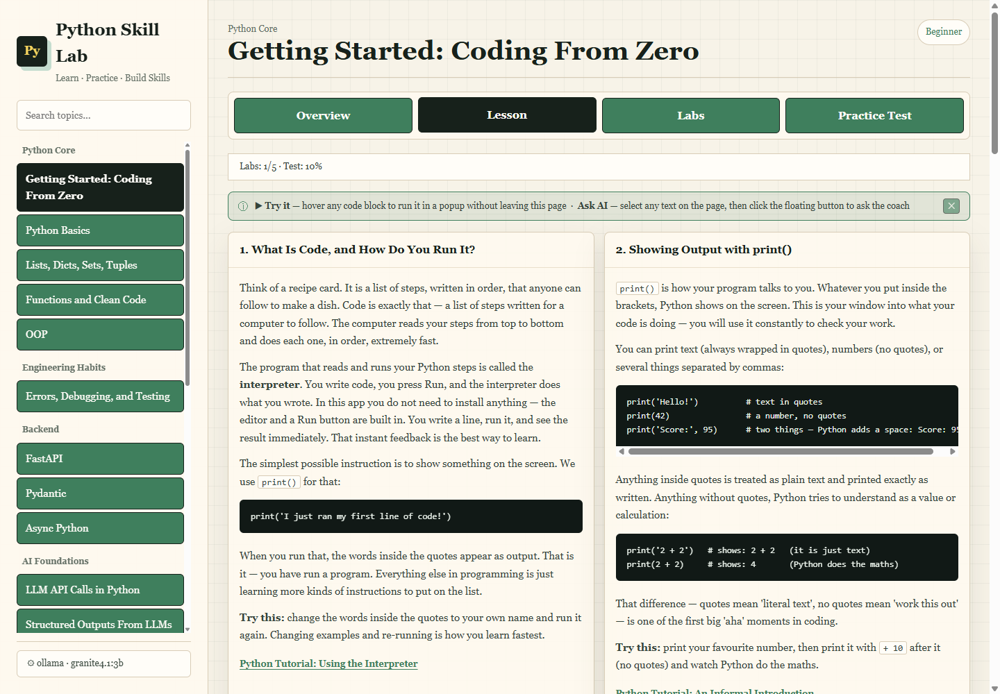
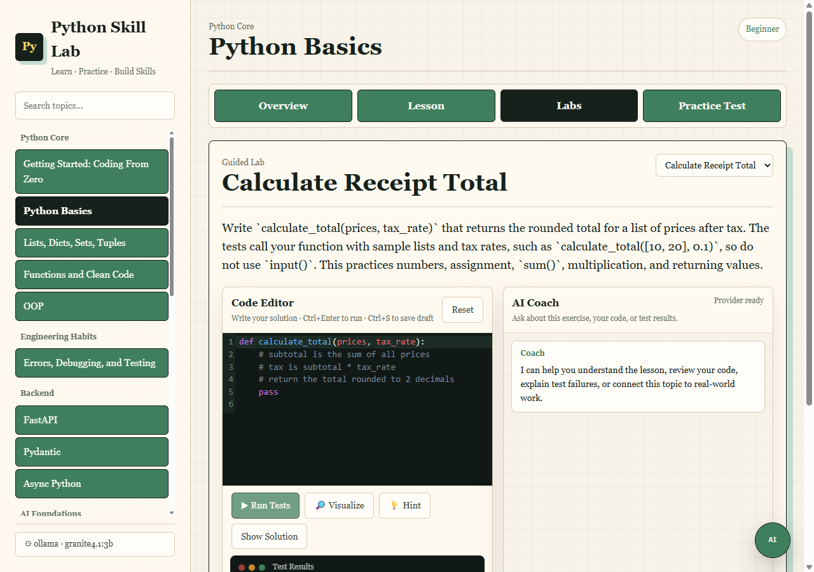
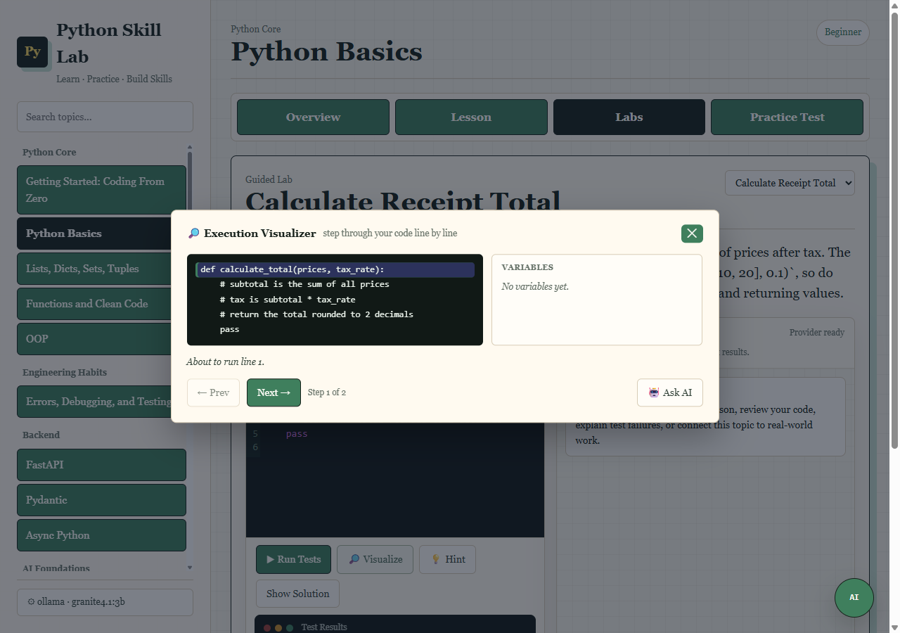

# Python Skill Lab

**A local desktop learning app for Python, backend APIs, DevOps automation, and AI engineering.** Runs entirely on your own machine — no account, no internet required, no server to manage.

> **⚠️ Personal use only — do not host for other people.**
> Python Skill Lab runs the code you write in a local subprocess on `127.0.0.1`. The code runner is designed for personal learning, not as a hardened security sandbox. **Do not deploy this on a shared, public, or multi-user server and do not expose the port to a network.** On your own desktop it is no more powerful than your own terminal, which is exactly the point.

## Who This Is For

This app is built for **complete beginners** — people who want to get into Python and AI programming and may have never written a line of code before.

- **Never coded before?** Start with the **Getting Started: Coding From Zero** topic. It assumes no prior programming knowledge and explains what code is, how to run it, variables, types, your first function, and how to read errors without panicking.
- **Know another language, or returning to coding?** You can jump straight to **Python Basics** and move quickly through the Python Core track.
- **Heading toward AI engineering?** Python is the foundation for AI work. Once you are comfortable with the Python Core track, the FastAPI, Pydantic, LangChain, LangGraph, MCP, and RAG topics take you into modern AI application development.

Every topic follows the same flow: overview → lesson → hands-on labs → practice test, with an optional AI coach that guides you without giving away the answer.

## Requirements

- Python 3.10 or newer
- No `pip install` needed — the app uses only the Python standard library
- Optional: an AI provider key or a local Ollama/LM Studio instance for the AI coach feature (the app works fine without one)

## Run

```powershell
python app.py
```

Then open `http://127.0.0.1:8765` in your browser.

The app runs fully offline — the code editor is bundled in `static/vendor/` and the UI uses system fonts, with no CDN calls at runtime.

## Screenshots








## Tests

```powershell
pip install -r requirements-dev.txt
python -B -m pytest tests -q -p no:cacheprovider
```

`pytest` is the only dev dependency. The app itself needs no `pip install`. Run the full suite before publishing changes.

## What It Covers

- 21 topics: Python basics, functions, data structures, OOP, errors/testing, async, LLM API calls, structured LLM outputs, basic AI evaluation, basic AI app architecture, FastAPI, Pydantic, SQL/HTTP/Git, Python for DevOps, LangChain, LangGraph, MCP, RAG/embeddings, simple RAG project, tool calling — plus a zero-knowledge Getting Started on-ramp; 122 labs total, including Advanced capstones for the 17 capstone topics
- Topic flow: overview → lesson (with inline concept diagrams) → hands-on labs → practice test
- **Capstone labs** — one advanced multi-function project per major track (Python Core, Backend, AI Apps, DevOps, Engineering Habits) that integrates concepts from across the track
- **Learner readiness signals** — sidebar badges show lab progress, the latest submitted practice-test score, and whether a topic is started, core-ready, or complete
- **Execution Visualizer** — step through your own code line by line, watching variables change; draggable overlay, available in every editor; beginner-friendly error explanations for both runtime and syntax errors
- Practice exercises with local test runner, an embedded AI Coach for lab code/test feedback, and a floating Ask AI messenger for lesson text, Try It examples, selected text, and Visualizer steps; supports parallel chat sessions (switch between separate conversations without losing any of them) and streams replies where providers support it; supports 8 providers (Ollama, LM Studio, OpenAI, Anthropic, Google AI Studio, Grok, Groq Cloud, Azure AI Foundry)
- AI Settings separates local model discovery from connection testing: Ollama/LM Studio use **Show local models** plus **Test selected model**, while hosted APIs use **Verify provider** for the configured key/model.
- The AI Coach is optional and needs a one-time setup. On first run, a dismissible banner points to ⚙ AI Settings; the easiest path is a hosted provider (OpenAI, Anthropic, Google, or Groq) with an API key — no local install. When AI is not configured, the app shows plain-language guidance instead of a cryptic error.

## Content System

Curriculum content now lives in `content/` as structured files (per-topic `topic.json`, `lesson.md`, `labs.json`, `practice.json`) plus `content/sources.json`.

The app loads this through `content_loader.py` and keeps the same `/api/curriculum` response shape used by the current UI.

## Project Docs

- Setup and configuration: [`SETUP.md`](SETUP.md)
- Contributing: [`CONTRIBUTING.md`](CONTRIBUTING.md)
- Security policy: [`SECURITY.md`](SECURITY.md)
- Code of conduct: [`CODE_OF_CONDUCT.md`](CODE_OF_CONDUCT.md)
- License: [`MIT`](LICENSE)

## Notes

The code runner executes snippets locally with a short timeout. Treat it as a practice tool, not a security sandbox for untrusted code.

AI request timeout defaults are intentionally short so the learning UI does not appear frozen if a provider is down:

- `PY_SKILL_LAB_AI_TIMEOUT_SECONDS` (default `45`) for AI coach calls; local models may need one warm-up request after launch
- `PY_SKILL_LAB_AI_PROVIDER_TEST_TIMEOUT_SECONDS` (default `20`) for hosted Verify Provider health checks
- `PY_SKILL_LAB_AI_MODELS_TIMEOUT_SECONDS` (default `8`) for model list refresh
- `PY_SKILL_LAB_AI_PROVIDER`, `PY_SKILL_LAB_AI_MODEL`, and `PY_SKILL_LAB_AI_ENDPOINT` store the last selected provider settings; API keys stay server-side and are never echoed back into the browser

UI theme note: dark mode has been removed for now. The app uses a single warm light theme to avoid inconsistent contrast and readability issues.

For full setup, deployment, and AI provider notes, see `SETUP.md`.
